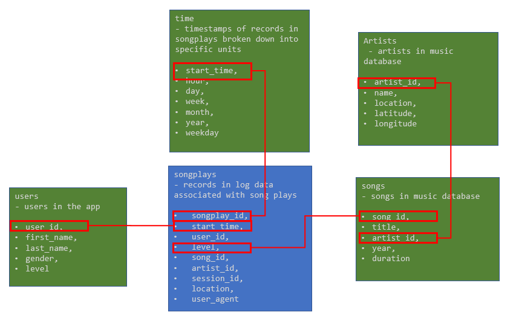
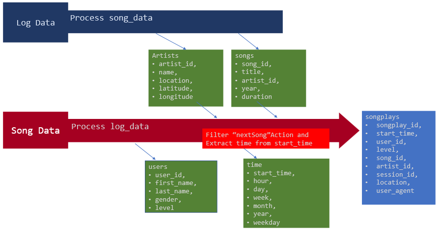

# How to run the Python scripts
- Create tables  
	```
	python create_table.py
	```
- Execute ETL  
	```
	python etl.py
	```

# repository  
  - data:
    - song_data
		contains metadata about a song and the artist of that song  
		```
		{"num_songs": 1, "artist_id": "ARKFYS91187B98E58F", "artist_latitude": null, "artist_longitude": null, "artist_location": "", "artist_name": "Jeff And Sheri Easter", "song_id": "SOYMRWW12A6D4FAB14", "title": "The Moon And I (Ordinary Day Album Version)", "duration": 267.7024, "year": 0}
		```

	- log_data
		Based on the songs in the above dataset, the event simulator simulates activity logs from music streaming apps.
		```
		{"artist":null,"auth":"Logged In","firstName":"Walter","gender":"M","itemInSession":0,"lastName":"Frye","length":null,"level":"free","location":"San Francisco-Oakland-Hayward, CA","method":"GET","page":"Home","registration":1540919166796.0,"sessionId":38,"song":null,"status":200,"ts":1541105830796,"userAgent":"\"Mozilla\/5.0 (Macintosh; Intel Mac OS X 10_9_4) AppleWebKit\/537.36 (KHTML, like Gecko) Chrome\/36.0.1985.143 Safari\/537.36\"","userId":"39"}
		{"artist":null,"auth":"Logged In","firstName":"Kaylee","gender":"F","itemInSession":0,"lastName":"Summers","length":null,"level":"free","location":"Phoenix-Mesa-Scottsdale, AZ","method":"GET","page":"Home","registration":1540344794796.0,"sessionId":139,"song":null,"status":200,"ts":1541106106796,"userAgent":"\"Mozilla\/5.0 (Windows NT 6.1; WOW64) AppleWebKit\/537.36 (KHTML, like Gecko) Chrome\/35.0.1916.153 Safari\/537.36\"","userId":"8"}
		```

 - Script:
	- create_tables.py  
			Delete table.  
			Create table.  
			When re-running the ETL script, this script must be run to reset the table.  
		
	- sql_queries.py  
		Imported by create_tables.py, etl.py(etl.ipynb).  
		Define tables, inserts, and Find queries.  
　　
	- etl.py  
			Define ETL  
			reads and processes files from song_data and log_data and loads them into the 5 tables

 - Notebook

	- test.ipynb  
			Checks that tables are defined correctly.  

	- etl.ipynb  
			It reads and processes a single file from a table and loads the data log_data into the table song_data.  
			This notebook contains detailed instructions on the ETL process for each table.  
			The logic implemented in etl.py is examined here.  


# Database schema design  
  
- Fact Table
  - songplays  
	records in log data associated with song plays i.e. records with page NextSong  
	```
	songplay_id,
	start_time,
	user_id,
	level,
	song_id,
	artist_id,
	session_id,
	location,
	user_agent 
	```
- Dimension Tables
  - users   
	users in the app   
	```
	user_id,
	first_name,
	last_name,
	gender,
	level
	```
  - songs  
	songs in music database  
	```
	song_id,
	title,
	artist_id,
	year,
	duration
	```
  - artists  
	artists in music database
	```
	artist_id,
	name,
	location,
	latitude,
	longitude
	```
  - time  
	timestamps of records in songplays broken down into specific units  
	```
	start_time,
	hour, 
	day, 
	week, 
	month, 
	year, 
	weekday
	```


# ETL pipeline

- Process song_data  
	 ETL on the first dataset, song_data, to create the songs and artists dimensional tables.  

	- songs Table  
			Extract Data for Songs Tabls  
	- artists Table  
			Extract Data for Artists Table  

- Process log_data
	  ETL on the second dataset, log_data, to create the time and users dimensional tables, as well as the songplays fact table.  

	- time Table  
		Extract Data for Time Table  

	- users Table  
		Extract Data for Users Table  

	- songplays Table  
		Extract Data and Songplays Table  
