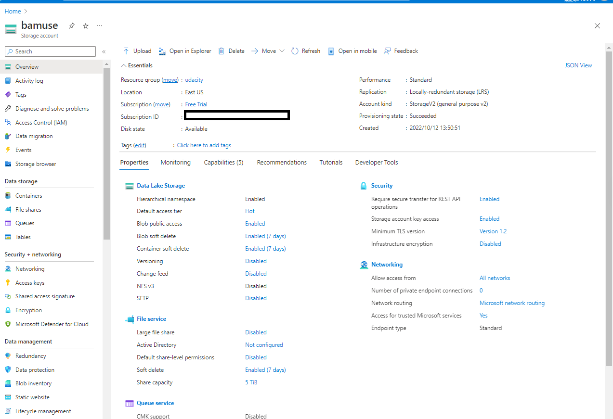
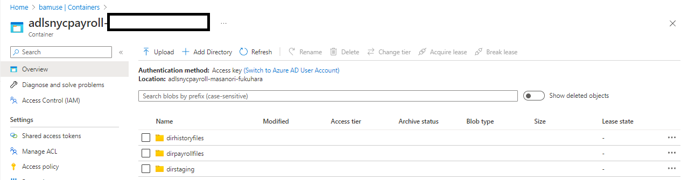
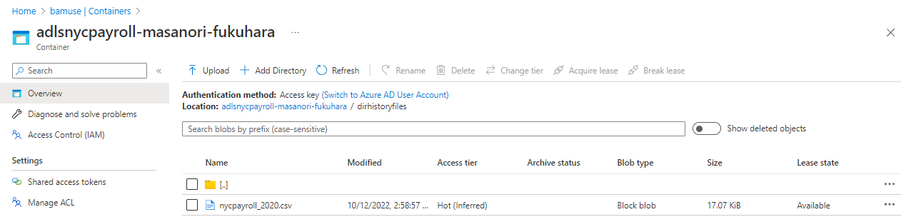
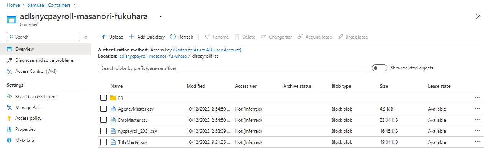
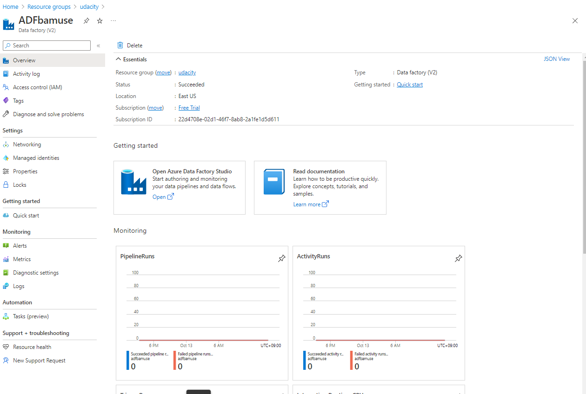
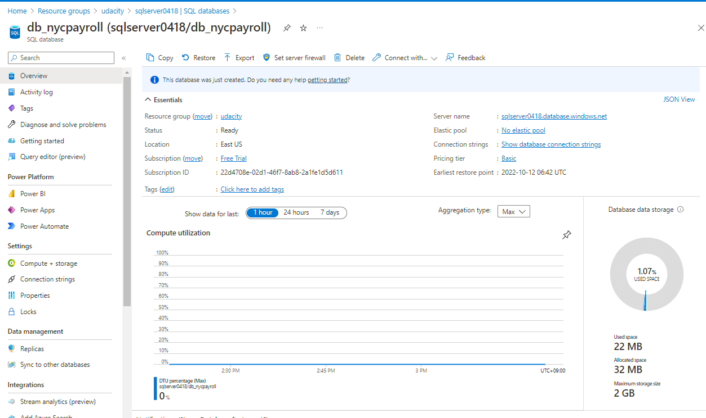
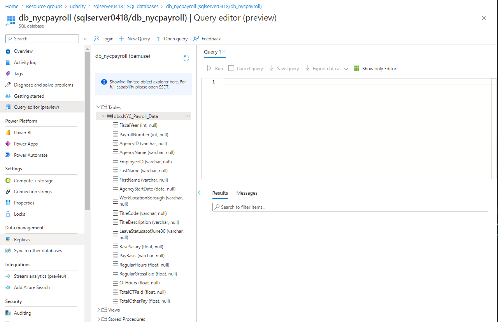
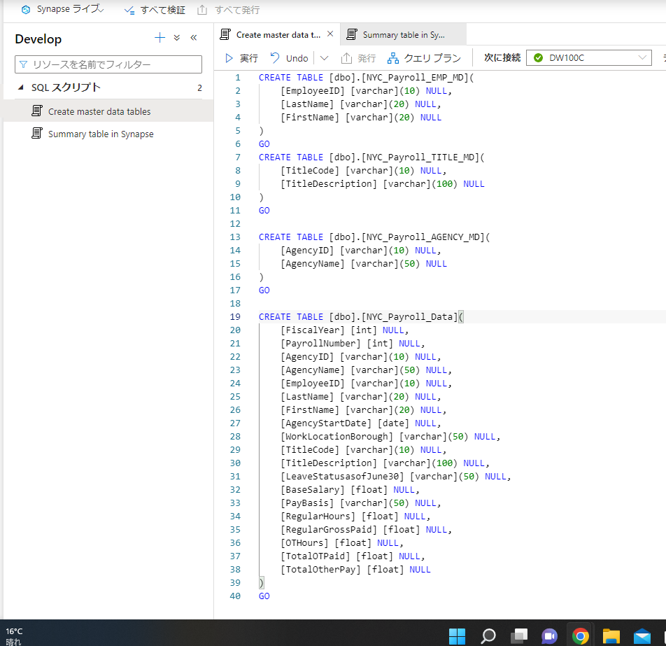
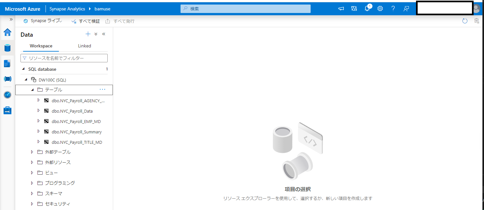

# Git repository for ADF CI/CD
https://github.com/fbamuse/NYCPayrollDataAnalytics

# Creating Resources  
## Data Lake gen2
 

## Data Factory

## SQL database

  

## Synapse Analyitics

  
# Linked Services

  
# Dataset

  

  
# flow

  
# pipeline

  

# Aggregate Data Flow

# Connect to Github

